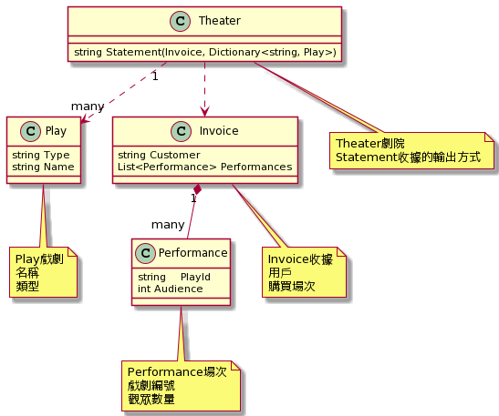

````
@startuml

class Play {
    string Type
    string Name
}


class Performance {
    string    PlayId
    int Audience

}

class Invoice {
    string Customer
    List<Performance> Performances
} 

class Theater {
   {method} string Statement(Invoice, Dictionary<string, Play>)
}

Invoice "1" *-- "many" Performance
Theater ..> Invoice
Theater "1"..>"many" Play

note "Play戲劇\n名稱\n類型" as play
Play .. play

note "Performance場次\n戲劇編號\n觀眾數量" as performance
Performance .. performance

note "Invoice收據\n用戶\n購買場次" as invoice
Invoice .. invoice

note "Theater劇院\nStatement收據的輸出方式" as theater
Theater .. theater

@enduml
```