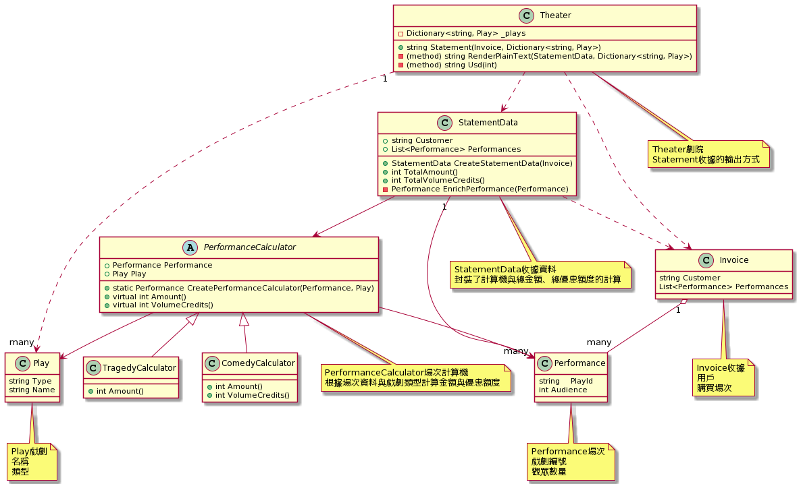

```
@startuml

class Play {
    string Type
    string Name
}


class Performance {
    string    PlayId
    int Audience

}

class Invoice {
    string Customer
    List<Performance> Performances
} 

class Theater {
   {method} string Statement(Invoice, Dictionary<string, Play>)
}

Invoice "1" o-- "many" Performance
Theater ..> Invoice
Theater "1"..>"many" Play

note "Play戲劇\n名稱\n類型" as play
Play .. play

note "Performance場次\n戲劇編號\n觀眾數量" as performance
Performance .. performance

note "Invoice收據\n用戶\n購買場次" as invoice
Invoice .. invoice

note "Theater劇院\nStatement收據的輸出方式" as theater
Theater .. theater

@enduml
```

After refactoring

```
@startuml

abstract class PerformanceCalculator {
    + Performance Performance
    + Play Play
    
    + static Performance CreatePerformanceCalculator(Performance, Play)
    + virtual int Amount()
    + virtual int VolumeCredits()
}

class TragedyCalculator {
    + int Amount()
}

class ComedyCalculator {
    + int Amount()
    + int VolumeCredits()
}

class StatementData {
    + string Customer
    + List<Performance> Performances
    + StatementData CreateStatementData(Invoice)
    + int TotalAmount()
    + int TotalVolumeCredits()
    - Performance EnrichPerformance(Performance)
    
}

class Play {
    string Type
    string Name
}


class Performance {
    string    PlayId
    int Audience

}

class Invoice {
    string Customer
    List<Performance> Performances
} 

class Theater {
   -  Dictionary<string, Play> _plays
   + {method} string Statement(Invoice, Dictionary<string, Play>)
   - (method) string RenderPlainText(StatementData, Dictionary<string, Play>)
   - (method) string Usd(int)
}

Invoice "1" o-- "many" Performance
Theater ..> Invoice
Theater "1"..>"many" Play
Theater ..>  StatementData
StatementData ..> Invoice
StatementData "1" --> "many" Performance
StatementData --> PerformanceCalculator
PerformanceCalculator --> Performance
PerformanceCalculator --> Play
PerformanceCalculator <|-- TragedyCalculator
PerformanceCalculator <|-- ComedyCalculator

note "Play戲劇\n名稱\n類型" as play
Play .. play

note "Performance場次\n戲劇編號\n觀眾數量" as performance
Performance .. performance

note "Invoice收據\n用戶\n購買場次" as invoice
Invoice .. invoice

note "Theater劇院\nStatement收據的輸出方式" as theater
Theater .. theater

note "PerformanceCalculator場次計算機\n根據場次資料與戲劇類型計算金額與優惠額度" as performanceCalculator
PerformanceCalculator .. performanceCalculator

note "StatementData收據資料\n封裝了計算機與總金額、總優惠額度的計算" as statementData
StatementData .. statementData

@enduml
```